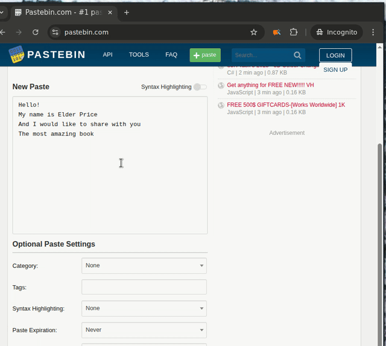

# WrAIter Chrome Extension




## Introduction

WrAIter is a Chrome browser extension designed to enhance text editing on any webpage by providing AI-powered suggestions. I wrote it because it's a functionality I was missing myself, but also to learn vibe-coding. It allows users to select editable text, access a popup interface, and receive AI-generated alternatives based on their specific queries. The extension supports multiple AI models, including various Gemini and OpenAI GPT variants, and offers features like customizable quick queries, optional context input, and token usage tracking.

## Installation

### Prerequisites

-   Node.js and npm
-   Chrome browser
-   API keys for desired AI providers

### Build Process

1.  Install dependencies: `npm install`
2.  Development mode: `npm run watch`
3.  Production build: `npm run build`

### Load as Unpacked Extension in Chrome

After building the extension with `npm`:

1.  Open Chrome and navigate to `chrome://extensions/`.
2.  Enable "Developer mode" by toggling the switch in the top right corner.
3.  Click the "Load unpacked" button in the top left corner.
4.  Select the `dist` folder from your project directory.
5.  The extension should now appear in your list of extensions and be ready to use.

## Development

### Tech Stack

-   **Language:** JavaScript (ES6+)
-   **Bundler:** Webpack
-   **Styling:** CSS3
-   **AI Integration:** Gemini & OpenAI APIs

### Project Structure

```
WrAIter/
├── dist/                       # Bundled files
├── src/                        # Source files
│   ├── assets/                 # Static assets
│   │   └── icons/
│   ├── background/            # Background script
│   ├── content/               # Content script
│   ├── options/               # Options page
│   ├── popup/                 # Popup interface
│   ├── shared/                # Shared utilities
│   └── manifest.json          # Extension manifest
├── .gitignore
├── AGENTS.md
├── package.json
├── package-lock.json
└── webpack.config.js
```

### Core Components (High-Level)

-   **Popup (`popup/`):** Main user interface for input, displaying suggestions, and user interaction.
-   **Content Script (`content/`):** Injected into webpages to handle text selection and apply changes.
-   **Background Script (`background/`):** Manages extension state, communication between components, and API requests.
-   **Options Page (`options/`):** Configuration interface for API keys, quick queries, and settings.
-   **AI Service (`shared/ai_service.js`):** Module for interacting with various AI model APIs.

### Data Flow

1.  User selects text on a webpage.
2.  Popup opens and displays selected text.
3.  User enters query and optional context.
4.  Background script processes request with AI service.
5.  Suggestions are displayed in popup.
6.  User selects and applies desired suggestion.
7.  Content script updates the webpage.

## License

[License information to be added] 